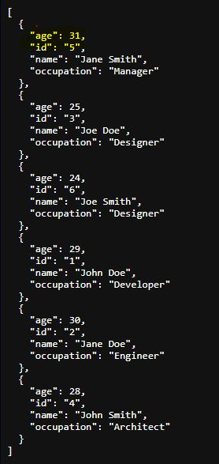
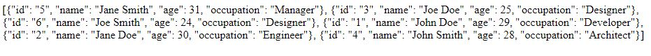

<h1>Match</h1>
<h4>Result before:</h4>
<p>On this current function a linear search algorithm was implemented with time complexity Omega(n1*n2)</p>


<h4>Result after:</h4>
<p> To optimize the search I use set interaction so now the time complexity is Omega(min(len(n1), len(n2)))</p>

 ```python
   return set(fave_numbers_1) & set(fave_numbers_2) == set(fave_numbers_2)
 ```


<h1>Search</h1>

In the expected result:
```
[
  {"id": "1", "name": "John Doe", "age": 29, "occupation": "Developer"},
  {"id": "2", "name": "Jane Doe", "age": 30, "occupation": "Engineer"},
  {"id": "3", "name": "Joe Doe", "age": 25, "occupation": "Designer"},
  {"id": "4", "name": "John Smith", "age": 28, "occupation": "Architect"},
  {"id": "5", "name": "Jane Smith", "age": 31, "occupation": "Manager"},
  {"id": "6", "name": "Joe Smith", "age": 24, "occupation": "Designer"}
]
```
due to the serialization in Flask JSON, the keys are sorted alphabetically. To preserve the desired order, uncomment the following code:

```python
return json.dumps(sorted_results)
```
<h4>Result for json</h4>

<h4>Result for json dumps</h4>



